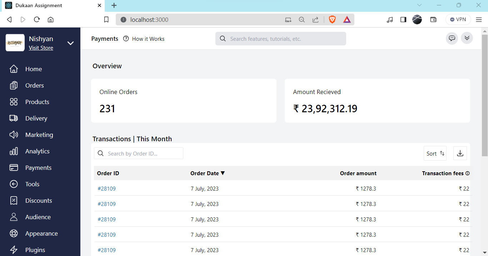

# Dukaan Assignment 

 
  <kbd>
    
  </kbd>

A React project featuring a homepage utilizes the powerful combination of React for dynamic UI and Tailwind CSS for streamlined styling. Leveraging React's component-based architecture, the homepage can be modular and easily maintainable. Tailwind CSS facilitates rapid and responsive design with its utility-first approach. This synergy allows for a visually appealing and interactive user interface. The homepage can showcase various sections, incorporating dynamic content and smooth transitions. As a Software Development Engineer with an interest in tech, this project not only hones your React skills but also aligns with your passion for creating engaging and efficient user experiences.
